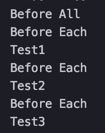
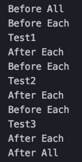
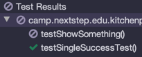
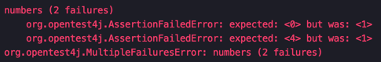
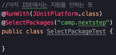
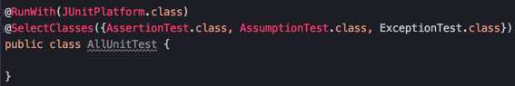

# JUnit5
## Dependency
maven dependency
```xml
<dependency>
    <groupId>org.junit.jupiter</groupId>
    <artifactId>junit-jupiter-engine</artifactId>
    <version>5.1.0</version>
    <scope>test</scope>
</dependency>
```

gradle dependency
~~~gradle
testCompile group: 'org.junit.jupiter', name: 'junit-jupiter-api', version: '5.1.0'
~~~
주의! ***Java 8***이 필요

## Architecture
JUnit5는 3개의 서브 프로젝트로 구성
1. JUnit Platform
2. JUnit Jupiter
3. Junit Vintage

### JUnit Platform
- JVM 위에서 테스트 프레임워크를 실행하는 역할

### JUnit Jupiter
- JUnit5에서 추가된 Annotation을 제공
    - @TestFactory - dynamic tests를 정의 할때 사용
    - @DisplayName - 하나의 테스트 클래스나 혹은 메소드의 display name을 정의
    - @Nested - denotes that the annotated class is a nested, non-static test class
    - @Tag - 테스트를 필터링 하기 위한 Tag를 정의
    - @ExtendWith - custom extension을 등록하기 위해 사용
    - @BeforeEach - 클래스 내의 각 테스트 메소드가 실행되기 전에 실행(이전 @Before와 같음)
    - @AfterEach - 클래스 내의 각 테스트 메소드가 실행된 직후에 실행(이전 @After와 같음)
    - @BeforeAll - 클래스 내의 모든 테스트 메소드가 실행되기 전에 실행(이전 @BeforeClass와 같음)
    - @AfterAll - 클래스 내의 모든 테스트 메소드가 실행된 뒤에 실행(이전 @AfterClass와 같음)
    - @Disable - 테스트 클래스나 메소드를 disable 시키는데 사용(이전 @Ignore와 같음)
    
어노테이션의 이름이 좀 더 직관적으로 변했다.

### JUnit Vintage
JUnit5 환경에서 JUnit3와 JUnit4 실행을 지원하기 위함

## 기본 Annotations
### @BeforeAll & @BeforeEach
```java
import org.junit.jupiter.api.BeforeAll;
import org.junit.jupiter.api.BeforeEach;
import org.junit.jupiter.api.Test;

class JUnit5Test {
    @BeforeAll
    static void setup() {
        System.out.println("Before All");
    }

    @BeforeEach
    void init() {
        System.out.println("Before Each");
    }

    @Test
    void test1() {
        System.out.println("Test1");
    }

    @Test
    void test2() {
        System.out.println("Test2");
    }

    @Test
    void test3() {
        System.out.println("Test3");
    }
}
```


### @AfterEach, @AfterAll
```java
import org.junit.jupiter.api.*;

class JUnit5Test {
    ...
    @AfterAll
    static void afterAll() {
        System.out.println("After All");
    }

    @AfterEach
    void afterEach() {
        System.out.println("After Each");
    }
}
```


### @DisplayName, @Disabled
```java
import org.junit.jupiter.api.Disabled;
import org.junit.jupiter.api.DisplayName;
import org.junit.jupiter.api.Test;

class DisplayNameAndDisabled {
    @DisplayName("Single test successful")
    @Test
    void testSingleSuccessTest() {
        System.out.println("Test success");
    }

    @Disabled("Not implemented yet")
    @Test
    void testShowSomething() {
    }
}
```



### Assertions
- 성능 향상, 람다식을 지원하기 시작
- 람다식을 assertion의 메세지로 전달했을때의 이점은 lazily evaluated된다는 점이다. 만약 메세지 생성비용이 비싼경우에는 시간과 자원을 아낄수 있다.
- assertAll()을 가지고 실패 에러가 여러개인 경우의 테스트도 가능
```java
import org.junit.jupiter.api.Test;
import java.util.stream.Stream;
import static org.junit.jupiter.api.Assertions.*;

public class Assertion {
    @Test
    void lambdaExp() {
        assertTrue(Stream.of(1, 2, 3)
                .mapToInt(i -> i)
                .sum() > 5, "Sum should be greater than 5");
    }

    @Test
    void groupAssertions() {
        int[] numbers = {0, 1, 2, 3, 4};
        assertAll("numbers",
                () -> assertEquals(numbers[0], 1),
                () -> assertEquals(numbers[3], 3),
                () -> assertEquals(numbers[4], 1)
        );
    }
}
```


### Assumptions
Assumptions는 특정 조건을 만족할 때만 테스트를 실행시킨다. 예를 들어 아래의 trueAssumption()에서 assertEquals(5+2, 6) 으로 변경했을 때는 test fail이 뜨지만, assumeTrue(5 < 1);을 사용할경우 아래 테스트를 스킵하게 된다.
```java
import org.junit.jupiter.api.Test;
import static org.junit.jupiter.api.Assertions.assertEquals;
import static org.junit.jupiter.api.Assumptions.*;

public class Assumption {
    @Test
    void trueAssumption() {
        assumeTrue(5 > 1);
        assertEquals(5 + 2, 7);
    }

    @Test
    void falseAssumption() {
        assumeFalse(5 < 1);
        assertEquals(5 + 2, 7);
    }

    @Test
    void assumptionThat() {
        String someString = "Just a string";
        assumingThat(
                someString.equals("Just a string"),
                () -> assertEquals(2 + 2, 4)
        );
    }
}
```

### ExceptionTest
```java
import org.junit.jupiter.api.Test;
import static org.junit.jupiter.api.Assertions.assertEquals;
import static org.junit.jupiter.api.Assertions.assertThrows;

public class ExceptionTest {
    @Test
    void shouldThrowException() {
        Throwable exception = assertThrows(UnsupportedOperationException.class, () -> {
            throw new UnsupportedOperationException("Not supported");
        });
        assertEquals(exception.getMessage(), "Not supported");
    }

    @Test
    void assertThrowsException() {
        String str = null;
        assertThrows(IllegalArgumentException.class, () -> {
            Integer.valueOf(str);
        });
    }
}
```
이전에 사용하던 @Test(expected = SomeException.class) 는 지원하지 않는다.

### Test Suites
JUnit5의 새 기능중 하나로, 하나의 test suite에 여러 테스트 클래스를 모아 한번에 실행하는 기능을 제공한다.
@SelectPackage 와 @SelectClasses를 제공함





### Dynamic Tests
runtime시에 생성된 테스트 케이스를 선언하고 실행할수 있게 하는기능
static test와는 다르게 런타임 시에 다이나믹한 테스트 케이스를 정의할 수 있다.
다이나믹 테스트는 @TestFactory 어노테이션을 사용해 만들수 있다.

```java
@TestFactory
public Stream<DynamicTest> translateDynamicTestsFromStream() {
    return in.stream()
     .map(word ->
      DynamicTest.dynamicTest("Test translate " + word, () -> {
          int id = in.indexOf(word);
          assertEquals(out.get(id), translate(word));
      })
       );
}
```


## reference
- [A Guide to JUnit 5](https://www.baeldung.com/junit-5)
