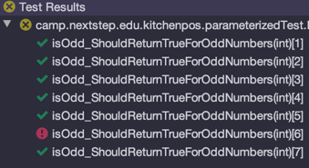

# Parameterized Tests
## Overview
parameterized tests는 Junit5에서 새롭게 제공하는 기능중 하나로, 하나의 테스트 메소드로 서로 다른 파라미터를 넘겨 여러번 테스트 가능하게 해줍니다.

## Dependencies
```xml
<dependency>
    <groupId>org.junit.jupiter</groupId>
    <artifactId>junit-jupiter-params</artifactId>
    <version>5.4.2</version>
    <scope>test</scope>
</dependency>
```
```gradle
testCompile("org.junit.jupiter:junit-jupiter-params:5.4.2")
```

## At glance
```java
public class Numbers {
    public static boolean isOdd(int number) {
        return number % 2 != 0;
    }
}
```
```java
import org.junit.jupiter.params.ParameterizedTest;
import org.junit.jupiter.params.provider.ValueSource;
import static org.junit.jupiter.api.Assertions.assertTrue;

class NumbersTest {
    @ParameterizedTest
    @ValueSource(ints = {1, 3, 5, -3, 13, 2, Integer.MAX_VALUE})
    void isOdd_ShouldReturnTrueForOddNumbers(int number) {
        assertTrue(Numbers.isOdd(number));
    }
}
```


## Argument Source
```java
public class Strings {
    public static boolean isBlank(String input) {
        return input == null || input.trim().isEmpty();
    }
}
```
```java
import org.junit.jupiter.params.ParameterizedTest;
import org.junit.jupiter.params.provider.ValueSource;
import static org.junit.jupiter.api.Assertions.assertTrue;

public class StringsTest {
    @ParameterizedTest
    @ValueSource(strings = {"", "  ", "not"})
    void isBlank_ShouldReturnTrueForNullOrBlankStrings(String input) {
        assertTrue(Strings.isBlank(input));
    }
}
```


### 주의사항
#### @ValueSource에서 지원하는 타입
- short
- byte
- int
- long
- float
- double
- char
- String
- Class
#### 한번에 하나의 argument만 전달할 수 있다.
#### String이나 Class라고 하더라도 null을 넘길수 없다.

### Null and Empty Values
```java
import org.junit.jupiter.params.ParameterizedTest;
import org.junit.jupiter.params.provider.EmptySource;
import org.junit.jupiter.params.provider.NullAndEmptySource;
import org.junit.jupiter.params.provider.NullSource;
import static org.junit.jupiter.api.Assertions.assertTrue;

public class NullTest {
    @ParameterizedTest
    @NullSource
    void isBlank_ShouldReturnTrueForNullInputs(String input) {
        assertTrue(Strings.isBlank(input));
    }

    @ParameterizedTest
    @EmptySource
    void isBlank_ShouldReturnTrueForEmptyStrings(String input) {
        assertTrue(Strings.isBlank(input));
    }

    @ParameterizedTest
    @NullAndEmptySource
    void isBlank_ShouldReturnTrueForNullAndEmptyStrings(String input) {
        assertTrue(Strings.isBlank(input));
    }
}
```
이 어노테이션들은 Collection이나 Arrays에 빈 값을 전달할 수 있다.


```java

import org.junit.jupiter.params.ParameterizedTest;
import org.junit.jupiter.params.provider.EmptySource;
import org.junit.jupiter.params.provider.NullAndEmptySource;
import org.junit.jupiter.params.provider.NullSource;
import org.junit.jupiter.params.provider.ValueSource;
import static org.junit.jupiter.api.Assertions.assertTrue;

public class NullTest {
    @ParameterizedTest
    @NullAndEmptySource
    @ValueSource(strings = {"  ", "\t", "\n"})
    void isBlank_ShouldReturnTrueForAllTypesOfBlankStrings(String input) {
        assertTrue(Strings.isBlank(input));
    }
}
```
위처럼 조합하여 사용하는 것도 가능하다.

### Enum
enum에 존재하는 여러 값을 테스트해보기 위해서 @EnumSource 어노테이션을 사용하면 된다.
```java
import org.junit.jupiter.params.ParameterizedTest;
import org.junit.jupiter.params.provider.EnumSource;

import java.time.Month;
import java.util.EnumSet;

import static org.junit.jupiter.api.Assertions.assertEquals;
import static org.junit.jupiter.api.Assertions.assertTrue;

public class EnumTest {
    @ParameterizedTest
    @EnumSource(Month.class) // passing all 12 months
    void getValueForAMonth_IsAlwaysBetweenOneAndTwelve(Month month) {
        int monthNumber = month.getValue();
        assertTrue(monthNumber >= 1 && monthNumber <= 12);
    }

    @ParameterizedTest // passing some of enum value
    @EnumSource(value = Month.class, names = {"APRIL", "JUNE", "SEPTEMBER", "NOVEMBER"})
    void someMonths_Are30DaysLong(Month month) {
        final boolean isALeapYear = false;
        assertEquals(30, month.length(isALeapYear));
    }

    @ParameterizedTest
    @EnumSource(value = Month.class,
            names = {"APRIL", "JUNE", "SEPTEMBER", "NOVEMBER", "FEBRUARY"},
            mode = EnumSource.Mode.EXCLUDE // exclude above enum values
    )
    void exceptFourMonths_OthersAre31DaysLong(Month month) {
        final boolean isALeapYear = false;
        assertEquals(31, month.length(isALeapYear));
    }

    @ParameterizedTest
    @EnumSource(value = Month.class, names = ".+BER", mode = EnumSource.Mode.MATCH_ANY) // regex
    void fourMonths_AreEndingWithBer(Month month) {
        EnumSet<Month> months =
                EnumSet.of(Month.SEPTEMBER, Month.OCTOBER, Month.NOVEMBER, Month.DECEMBER);
        assertTrue(months.contains(month));
    }
}
```

### CSV literals
> CSV (Comma Seperated Values)
```java
import org.junit.jupiter.params.ParameterizedTest;
import org.junit.jupiter.params.provider.CsvSource;
import static org.junit.jupiter.api.Assertions.assertEquals;

public class CsvTest {
    @ParameterizedTest
    @CsvSource({"test,TEST", "tEst,TEST", "Java,JAVA"})
    void toUpperCase_ShouldGenerateTheExpectedUppercaseValue(String input, String expected) {
        String actualValue = input.toUpperCase();
        assertEquals(expected, actualValue);
    }
    @ParameterizedTest
    @CsvSource(value = {"test:test", "tEst:test", "Java:java"}, delimiter = ':') // customizable 
    void toLowerCase_ShouldGenerateTheExpectedLowercaseValue(String input, String expected) {
        String actualValue = input.toLowerCase();
        assertEquals(expected, actualValue);
    }
}
```

### CSV Files
```java
import org.junit.jupiter.params.ParameterizedTest;
import org.junit.jupiter.params.provider.CsvFileSource;
import static org.junit.jupiter.api.Assertions.assertEquals;

public class CsvFileTest {
    @ParameterizedTest
    @CsvFileSource(resources = "/data.csv", numLinesToSkip = 1)
    void toUpperCase_ShouldGenerateTheExpectedUppercaseValueCSVFile(String input, String expected) {
        String actualValue = input.toUpperCase();
        assertEquals(expected, actualValue);
    }
}
```
data.csv
```
input,expected
test,TEST
tEst,TEST
Java,JAVA
```


@CsvFileSource는 모든 라인을 input으로 제공하지만 위에서 보다 시피 numLinesToSkip을 이용해서 헤더 라인을 제거할 수도 있다.
Default 로 UTF-8인코딩을 사용한다.

### Method
좀더 복잡한 argument를 전달하는 방법을 제공하는데, 메소드를 argument source로 사용하는 방법이다.
```java
import org.junit.jupiter.params.ParameterizedTest;
import org.junit.jupiter.params.provider.Arguments;
import org.junit.jupiter.params.provider.MethodSource;
import java.util.stream.Stream;
import static org.junit.jupiter.api.Assertions.assertEquals;
import static org.junit.jupiter.api.Assertions.assertTrue;

public class MethodTest {
    @ParameterizedTest
    @MethodSource("provideStringsForIsBlank")
    void isBlank_ShouldReturnTrueForNullOrBlankStrings(String input, boolean expected) {
        assertEquals(expected, Strings.isBlank(input));
    }

    private static Stream<Arguments> provideStringsForIsBlank() {
        return Stream.of(
                Arguments.of(null, true),
                Arguments.of("", true),
                Arguments.of("  ", true),
                Arguments.of("not blank", false)
        );
    }

    @ParameterizedTest
    @MethodSource // hmm, no method name ...
    void isBlank_ShouldReturnTrueForNullOrBlankStringsOneArgument(String input) {
        assertTrue(Strings.isBlank(input));
    }

    private static Stream<String> isBlank_ShouldReturnTrueForNullOrBlankStringsOneArgument() {
        return Stream.of(null, "", "  ");
    }

    @ParameterizedTest
    @MethodSource("camp.nextstep.edu.kitchenpos.parameterizedTest.StringParams#blankStrings")
    void isBlank_ShouldReturnTrueForNullOrBlankStringsExternalSource(String input) {
        assertTrue(Strings.isBlank(input));
    }
}
```
```java
import java.util.stream.Stream;

public class StringParams {
    static Stream<String> blankStrings() {
        return Stream.of(null, "", "  ");
    }
}
```
- 인자로 하나만 받는다면 Arguments abstraction을 사용하지 않아도 된다.
- methodSource에 이름을 제공하지 않는다면, 동일한 메소드명을 가진 static 메소드를 가져다 사용한다.

### CustomArgumentProvider
ArgumentsProvider 인터페이스를 구현하면 테스트 메소드의 인자로 argument를 전달할 수 있다.
```java
import org.junit.jupiter.api.extension.ExtensionContext;
import org.junit.jupiter.params.provider.Arguments;
import org.junit.jupiter.params.provider.ArgumentsProvider;
import java.util.stream.Stream;

public class BlankStringArgumentProvider implements ArgumentsProvider {
    @Override
    public Stream<? extends Arguments> provideArguments(ExtensionContext context) throws Exception {
        return Stream.of(
                Arguments.of((String) null),
                Arguments.of(""),
                Arguments.of("   ")
        );
    }
}
```
```java
import org.junit.jupiter.params.ParameterizedTest;
import org.junit.jupiter.params.provider.ArgumentsSource;
import static org.junit.jupiter.api.Assertions.assertTrue;

public class CustomArgumentTest {
    @ParameterizedTest
    @ArgumentsSource(BlankStringArgumentProvider.class)
    void isBlank_ShouldReturnTrueForNullOrBlankStringsArgProvider(String input) {
        assertTrue(Strings.isBlank(input));
    }
}
```

### Custom Annotation
skip... [참고](https://www.baeldung.com/parameterized-tests-junit-5#8-custom-annotation)

## Argument Conversion
### Implicit Conversion(암시적 변환)
```java
import org.junit.jupiter.params.ParameterizedTest;
import org.junit.jupiter.params.provider.CsvSource;
import java.time.Month;
import static org.junit.jupiter.api.Assertions.assertEquals;

public class ConversionTest {
    @ParameterizedTest
    @CsvSource({"APRIL", "JUNE", "SEPTEMBER", "NOVEMBER"}) // Passing strings
    void someMonths_Are30DaysLongCsv(Month month) {
        final boolean isALeapYear = false;
        assertEquals(30, month.length(isALeapYear));
    }
}
```
JUnit5가 String argument를 특정 Enum 타입으로 변환시켜주기 때문에 가능하다.
변환 가능한 목록
- UUID 
- Locale
- LocalDate, LocalTime, LocalDateTime, Year, Month, etc.
- File and Path
- URL and URI
- Enum subclasses

### Explicit Conversion(명시적 변환)
ArgumentConverter 인터페이스를 구현하면 원하는 형태로 변환이 가능하다.
```java
import org.junit.jupiter.api.extension.ParameterContext;
import org.junit.jupiter.params.converter.ArgumentConversionException;
import org.junit.jupiter.params.converter.ArgumentConverter;
import java.time.LocalDate;

public class SlashyDateConverter implements ArgumentConverter {
    @Override
    public Object convert(Object source, ParameterContext context) throws ArgumentConversionException {
        if (!(source instanceof String)) {
            throw new IllegalArgumentException("The argument should be a string: " + source);
        }
        try {
            String[] parts = ((String) source).split("/");
            int year = Integer.parseInt(parts[0]);
            int month = Integer.parseInt(parts[1]);
            int day = Integer.parseInt(parts[2]);

            return LocalDate.of(year, month, day);
        } catch (Exception e) {
            throw new IllegalArgumentException("Failed to convert", e);
        }
    }
}
```
```java
import org.junit.jupiter.params.ParameterizedTest;
import org.junit.jupiter.params.converter.ConvertWith;
import org.junit.jupiter.params.provider.CsvSource;
import java.time.LocalDate;
import static org.junit.jupiter.api.Assertions.assertEquals;

public class ExplicitTest {
    @ParameterizedTest
    @CsvSource({"2018/12/25,2018", "2019/02/11,2019"})
    void getYear_ShouldWorkAsExpected(
            @ConvertWith(SlashyDateConverter.class) LocalDate date, int expected) {
        assertEquals(expected, date.getYear());
    }
}
```

## Argument Accessor
argument수가 많을 경우에는 ArgumentAccessor를 이용하면 접근이 쉬워진다.
```java
import org.junit.jupiter.params.ParameterizedTest;
import org.junit.jupiter.params.aggregator.ArgumentsAccessor;
import org.junit.jupiter.params.provider.CsvSource;

public class ArgumentAccessorTest {
    @ParameterizedTest
    @CsvSource({"Isaac,,Newton,Isaac Newton", "Charles,Robert,Darwin,Charles Robert Darwin"})
    void fullName_ShouldGenerateTheExpectedFullName(ArgumentsAccessor argumentsAccessor) {
        String firstName = argumentsAccessor.getString(0);
        String middleName = (String) argumentsAccessor.get(1);
        String lastName = argumentsAccessor.get(2, String.class);
        String expectedFullName = argumentsAccessor.getString(3);
    }
}
```
```java
public class Person {
    String firstName;
    String middleName;
    String lastName;

    // constructor
    Person(String firstName, String middleName, String lastName) {
        this.firstName = firstName;
        this.middleName = middleName;
        this.lastName = lastName;
    }

    public String fullName() {
        if (middleName == null || middleName.trim().isEmpty()) {
            return String.format("%s %s", firstName, lastName);
        }

        return String.format("%s %s %s", firstName, middleName, lastName);
    }
}
```

## Argument Aggregator
ArgumentAggregator 인터페이스를 구현하면 좀 더 깔끔하게 원하는 대로 객체를 만들어 낼수 있다.
```java
import org.junit.jupiter.api.extension.ParameterContext;
import org.junit.jupiter.params.aggregator.ArgumentsAccessor;
import org.junit.jupiter.params.aggregator.ArgumentsAggregationException;
import org.junit.jupiter.params.aggregator.ArgumentsAggregator;

public class PersonAggregator implements ArgumentsAggregator {

    @Override
    public Object aggregateArguments(ArgumentsAccessor accessor, ParameterContext context)
            throws ArgumentsAggregationException {
        return new Person(accessor.getString(1), accessor.getString(2), accessor.getString(3));
    }
}
```
```java
import org.junit.jupiter.params.ParameterizedTest;
import org.junit.jupiter.params.aggregator.AggregateWith;
import org.junit.jupiter.params.aggregator.ArgumentsAccessor;
import org.junit.jupiter.params.provider.CsvSource;
import static org.junit.jupiter.api.Assertions.assertEquals;

public class ArgumentAccessorTest {
    @ParameterizedTest
    @CsvSource({"Isaac Newton,Isaac,,Newton", "Charles Robert Darwin,Charles,Robert,Darwin"})
    void fullName_ShouldGenerateTheExpectedFullName(
            String expectedFullName,
            @AggregateWith(PersonAggregator.class) Person person) {

        assertEquals(expectedFullName, person.fullName());
    }
}
```

## Customizing Display Names
```java
import org.junit.jupiter.params.ParameterizedTest;
import org.junit.jupiter.params.provider.EnumSource;
import java.time.Month;
import static org.junit.jupiter.api.Assertions.assertEquals;

public class CustomizingDisplayNameTest {
    @ParameterizedTest(name = "{index} {0} is 30 days long")
    @EnumSource(value = Month.class, names = {"APRIL", "JUNE", "SEPTEMBER", "NOVEMBER"})
    void someMonths_Are30DaysLong(Month month) {
        final boolean isALeapYear = false;
        assertEquals(30, month.length(isALeapYear));
    }
}
```
display name 도 커스터 마이징 할수 있다.
- {index} - invocation index로 치환됨
- {arguments} - is a placeholder for the complete, comma-separated list of arguments ?
- {0}, {1}, ... - 각 인자들로 치환됨

## reference
- [Guide to JUnit 5 Parameterized Tests](https://www.baeldung.com/parameterized-tests-junit-5)
